# Books Course Work

- **adm** - Super-admin client
- **admin** - Aurelia admin client
- **client** - Flutter end-user client
- **server** - Server
- **cloud** - Firebase Function to assign a role on user creation

# A list of books

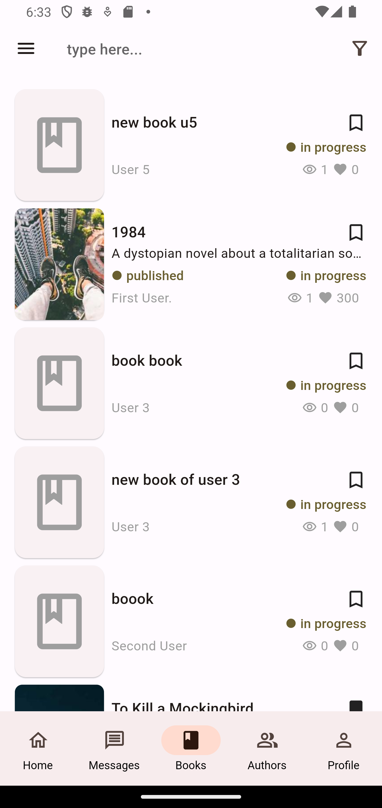
&nbsp;&nbsp;&nbsp;&nbsp;&nbsp;&nbsp;
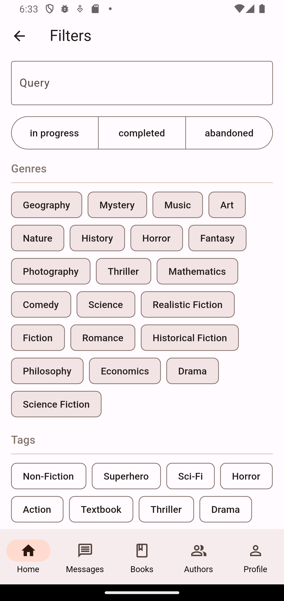 

# A list of authors

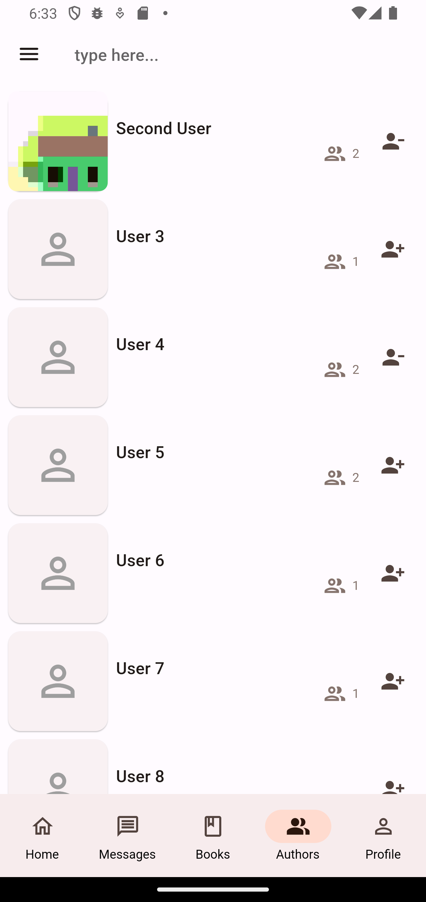 

# Messages page

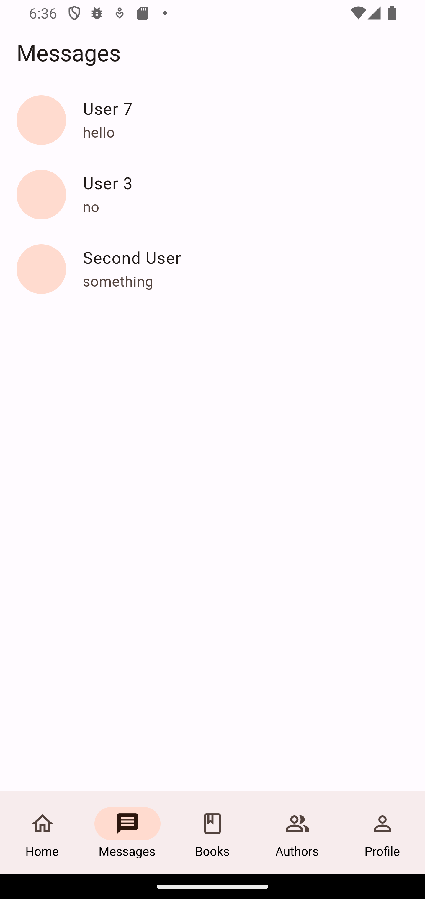 

# User chat

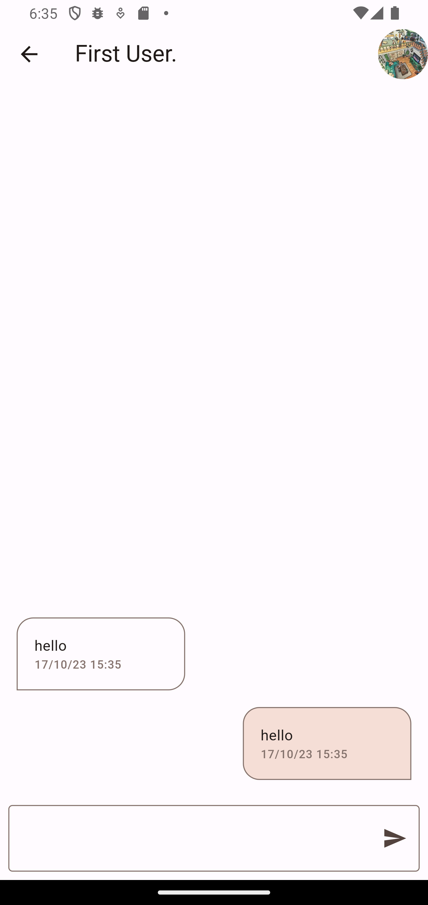 

# Home page

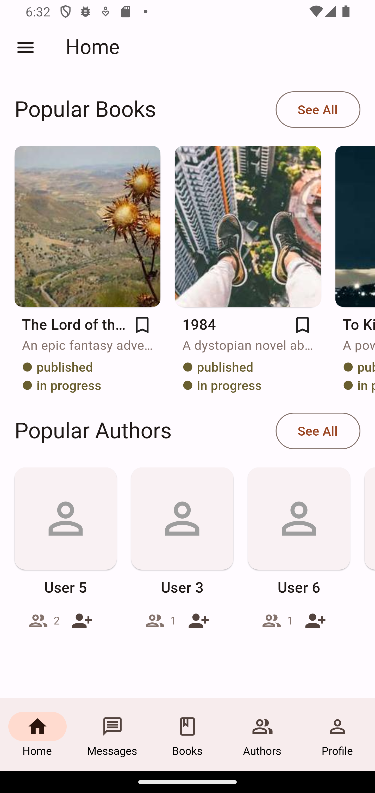 

# Profile page

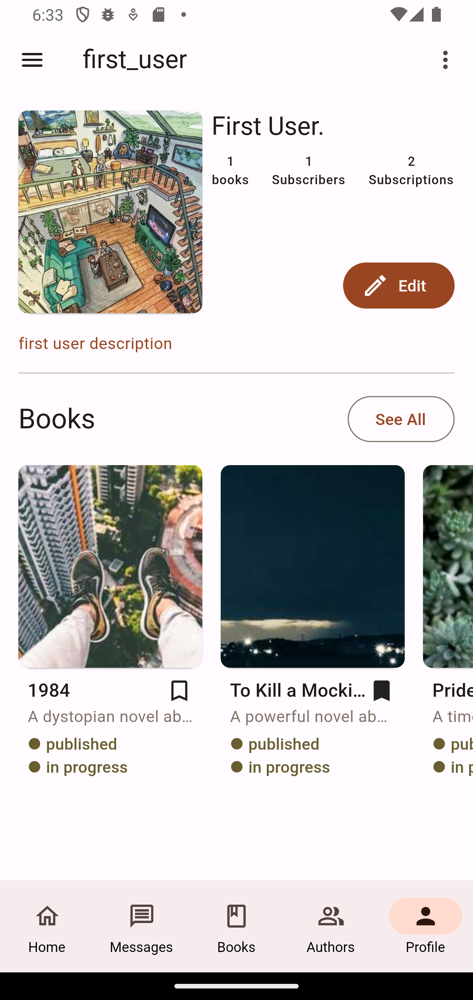 

# Drawer

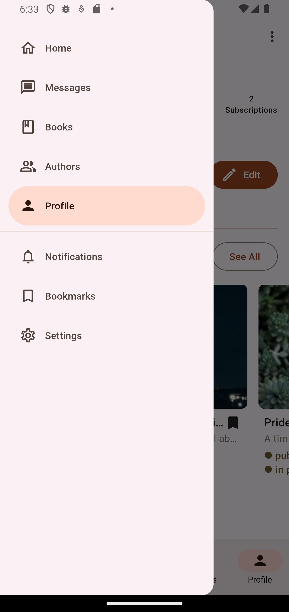 

# Book page

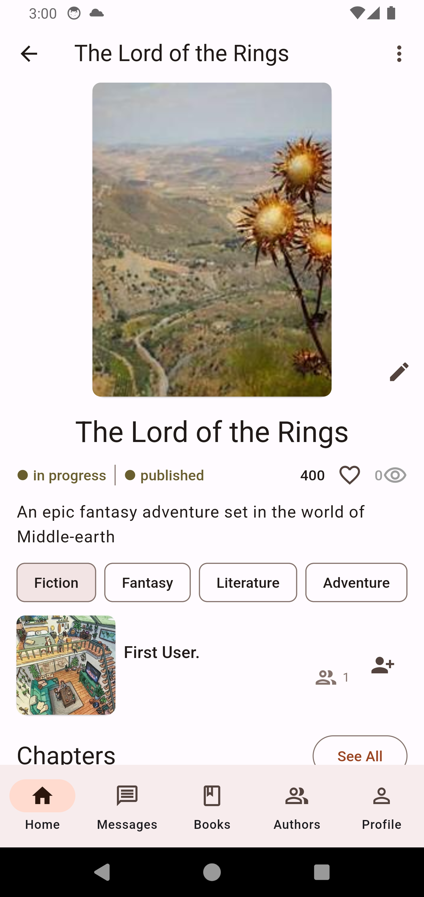 

# Comments

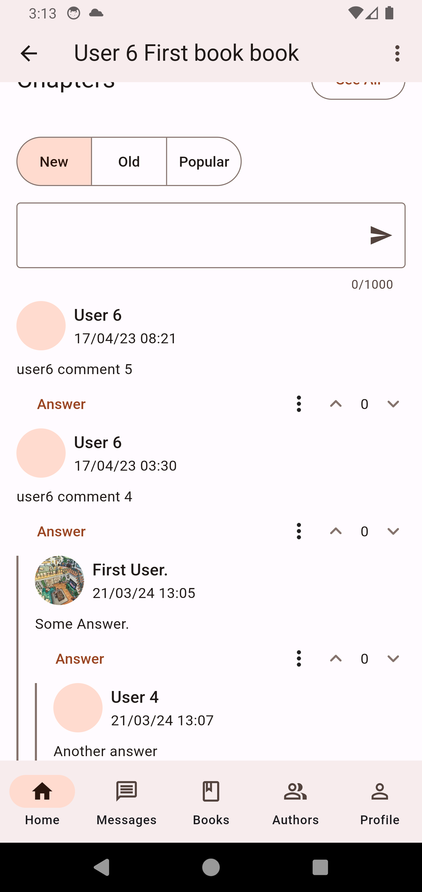 

# Chapter editor

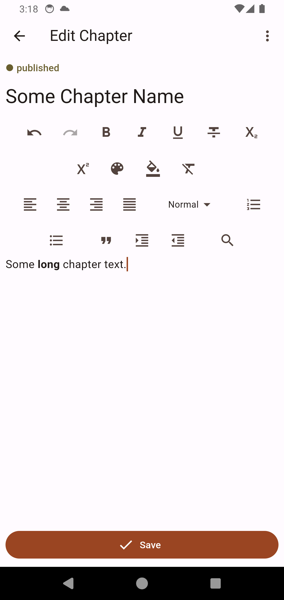 

# Chapter list

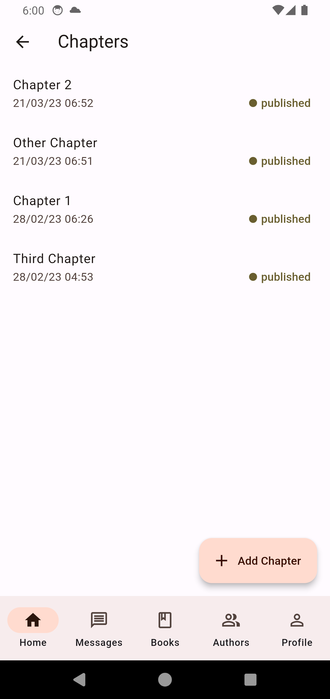 

# Reports

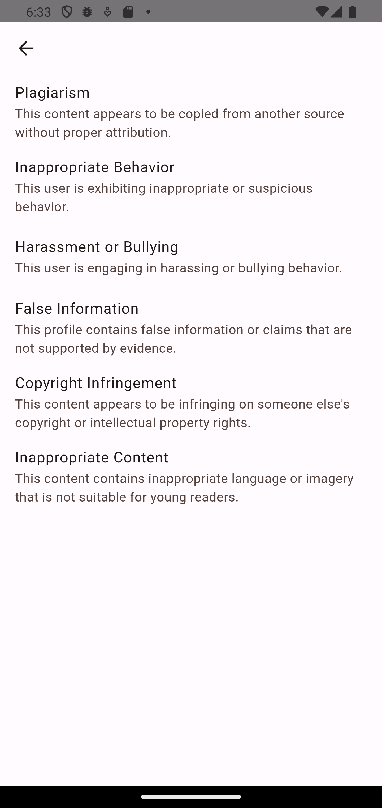 

# Create report page

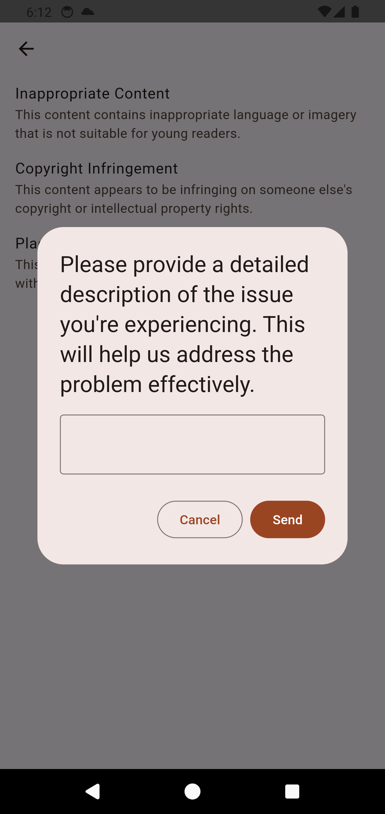 

# Reports (admin)

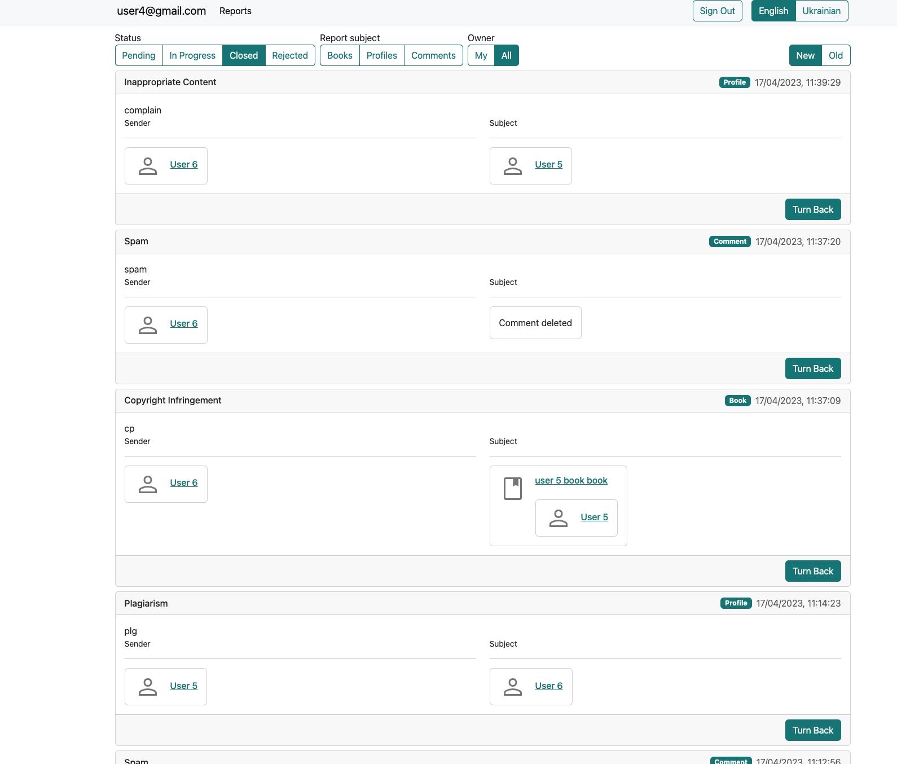 

# Report (admin)

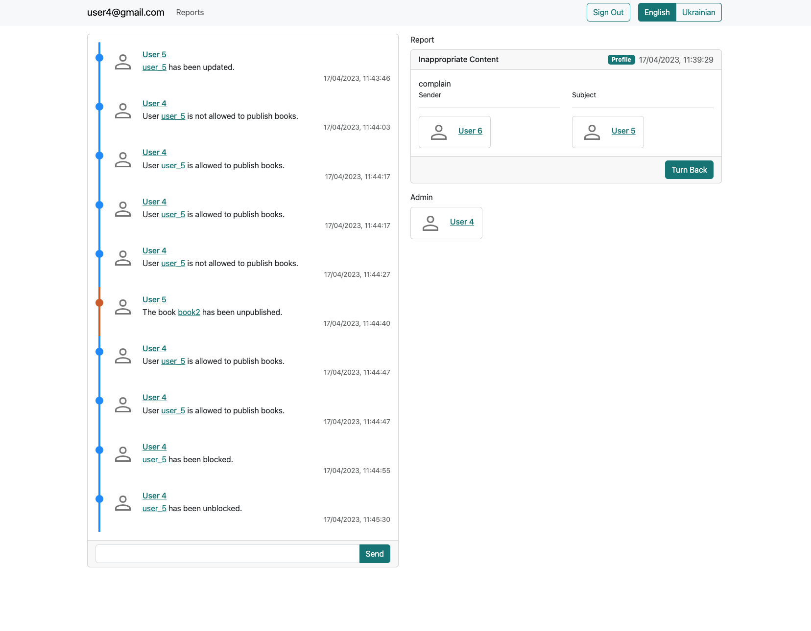 

# User profile (admin)

 

# User book (abmin)

